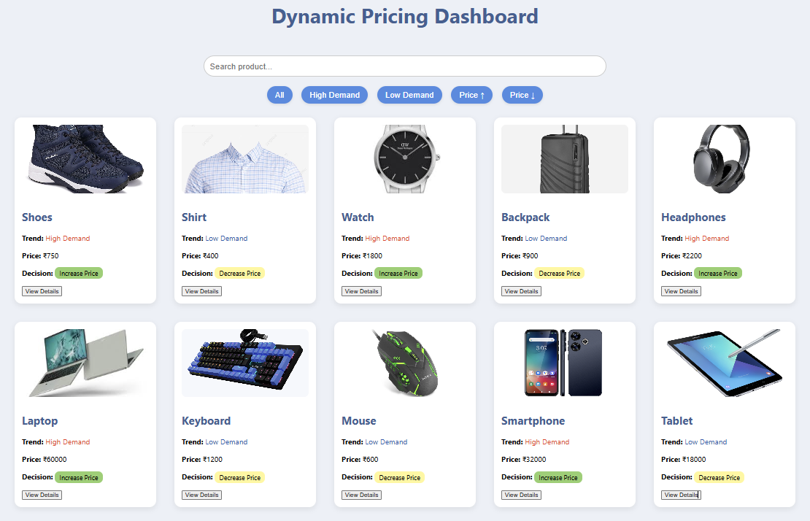
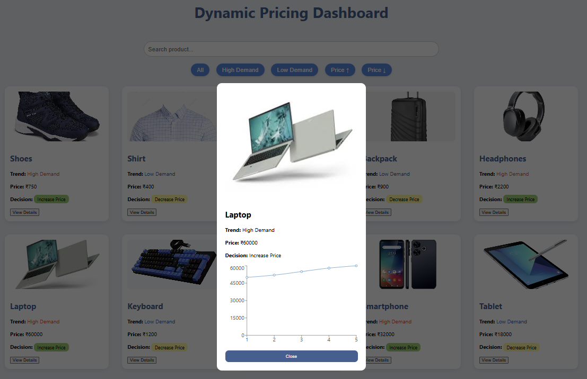

#  Dynamic Pricing Dashboard

A modern web-based dashboard that analyzes product demand trends and suggests optimized pricing strategies.

---

##  Project Overview

This project simulates a dynamic pricing system where product prices are adjusted based on demand trends.

* 📈 High Demand → Increase Price
* 📉 Low Demand → Decrease Price

It provides an interactive UI to visualize pricing decisions, product details, and historical price trends.

---

##  Features

*  Search products
*  Filter by demand (High / Low)
*  Sort by price (Low → High / High → Low)
*  Interactive price trend graph
*  Product images displayed in cards
*  Detailed product view (modal with graph)
*  Clean and modern UI

---

##  Tech Stack

### Frontend

* React.js
* Recharts (for graphs)
* CSS (inline styling)

### Backend (Logic)

* C++ (for pricing logic simulation)
* JSON (data exchange format)

---

##  Project Structure

```
dynamic-pricing/
├── pricing-ui/        # React frontend
│   ├── public/
│   │   ├── output.json
│   │   ├── images/
│   │   └── screenshots/
│   ├── src/
│   └── package.json
├── src/               # C++ backend logic
├── data/
```

---


##  How It Works

1. Backend (C++) generates pricing data
2. Data is stored in `output.json`
3. React frontend fetches this data
4. UI displays products dynamically
5. Graph shows price trend over time

---

## ▶ How to Run

### 1. Go to frontend folder

cd dynamic-pricing/pricing-ui

### 2. Install dependencies

npm install

### 3. Start the app

npm start

---

##  Screenshots

###  Dashboard View



###  Product Details (Graph View)


---

##  Future Improvements

*  Connect real backend API (instead of static JSON)
*  Add advanced analytics
*  Add user authentication
*  Deploy project online

---

##  Author

Kajal Singh
